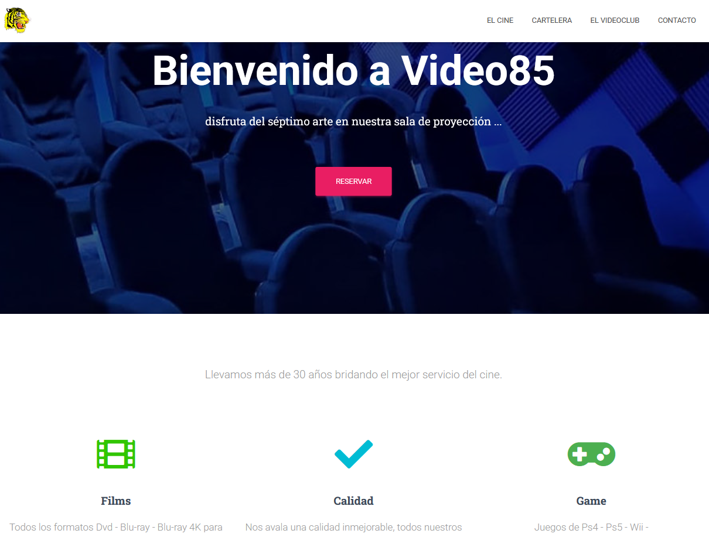
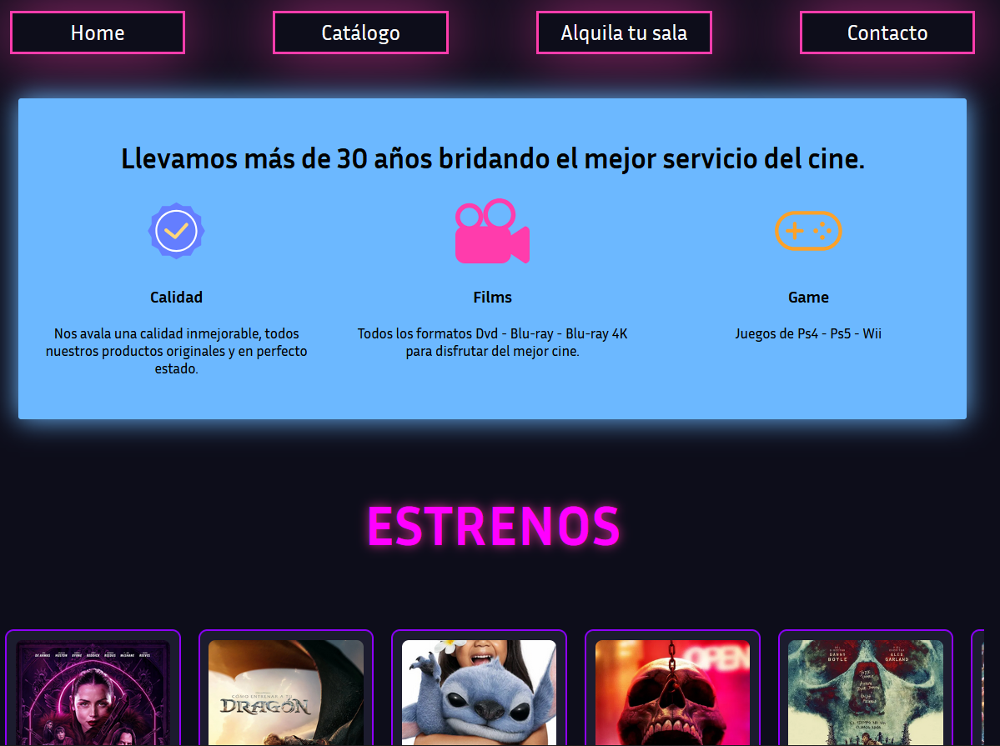

# 🎬 Videoclub85 – Rediseño del sitio web

## 📌 Objetivo del proyecto

Este proyecto tiene como objetivo **rediseñar el sitio web antiguo del videoclub** para hacerlo más moderno, fácil de usar. Buscamos mejorar la apariencia visual del sitio, la navegación y la experiencia general del usuario.

## 🛠️ Tecnologías utilizadas

- HTML5
- CSS3
- JavaScript
- Node.js
- Figma
- Git
- Jira

## 🚧 Estado

✅ Listo

## 🧩 Estructura del proyecto

```
📁 videoclub
├── 📁 img
│   └── 📁 covers
│   ├── muchas fotos
│   └── tigerheader.png
├── 📁 scripts
│   ├── catalogo.js
│   ├── crud.js
│   ├── layout.js
│   └── main.js
├── 📁 server
│   └── db.json
├── 📁 source
│   └── muchas fotos
├── 📁 styles
│   ├── admin.css
│   ├── catalogo.css
│   ├── layout.css
│   └── main.css
├── .gitignore
├── admin.html
├── catalogo.html
├── index.html
├── package-lock.json
├── package.json
└── README.md
```

## 🔍 Comparación: Diseño antiguo vs nuevo

### Diseño antiguo



### Nuevo diseño



## 👥 Equipo

- [@dmbiee](https://github.com/dmbiee)
- [@LinCarbajales](https://github.com/LinCarbajales)
- [@yolandaalfonso](https://github.com/yolandaalfonso)
- [@migueroder](https://github.com/migueroder)
- [@Marisol-Mancera](https://github.com/Marisol-Mancera)
